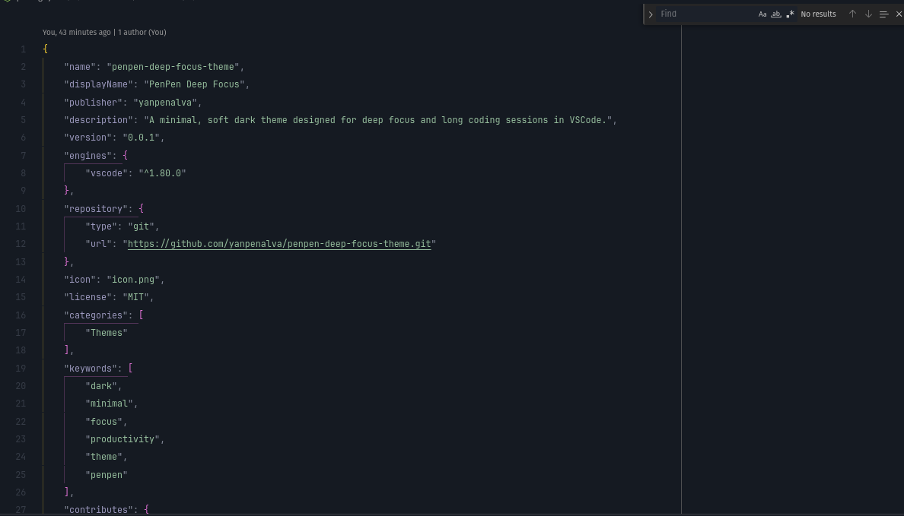

# PenPen Deep Focus Theme

**PenPen Deep Focus** is a minimalist dark theme for Visual Studio Code — designed for deep concentration, visual comfort, and long coding sessions.

Inspired by muted blue-gray and violet tones, it avoids harsh contrasts and bright highlights, maintaining harmony, balance, and immersion.

---

## 🎨 Features

-   Deep **blue-graphite background** (`#151A22`)
-   **Desaturated palette** — cool, neutral tones with no visual noise
-   **Gray-violet highlights** (`#9B98BE`) and **soft blues** (`#939FD1`)
-   Calibrated for **OLED / low-light environments**
-   Optimized readability with minimal eye strain

---

## 🧠 Philosophy

PenPen Deep Focus follows three principles:

1. **Absolute focus** — nothing distracts from the code.
2. **Tonal balance** — enough contrast, never visual stress.
3. **Immersive flow** — designed for deep work sessions.

---

## ⚙️ Installation

You can install **PenPen Deep Focus** directly from the Visual Studio Code Marketplace:

👉 [Install from VS Code Marketplace](https://marketplace.visualstudio.com/items?itemName=yanpenalva.penpen-deep-focus-theme)

Or via command line:

```bash
code --install-extension yanpenalva.penpen-deep-focus-theme
```

Once installed:

1. Open **Command Palette** (`Ctrl+Shift+P` / `Cmd+Shift+P` on macOS).
2. Search for **Color Theme** → select **PenPen Deep Focus**.

---

## 🕋 Recommended Setup

-   Use a **soft monospaced font** (JetBrains Mono, IBM Plex Mono, etc).
-   Enable **font ligatures** and set line height to `1.1–1.2`.
-   Ideal for backend, frontend, and writing-focused workflows.

---

## 📄 License

Distributed under the **MIT License**.

---

**Focus. Code. Keep your mind silent.**
